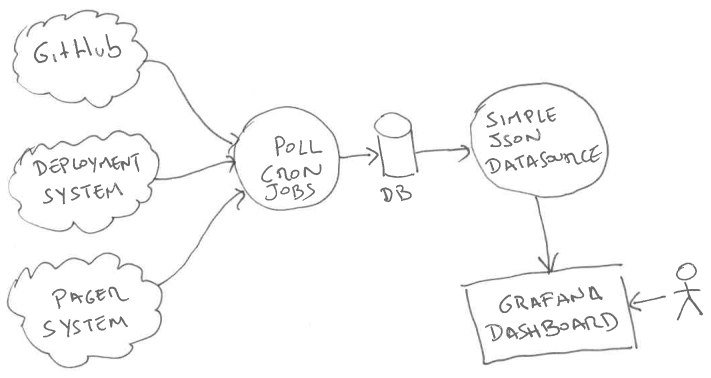
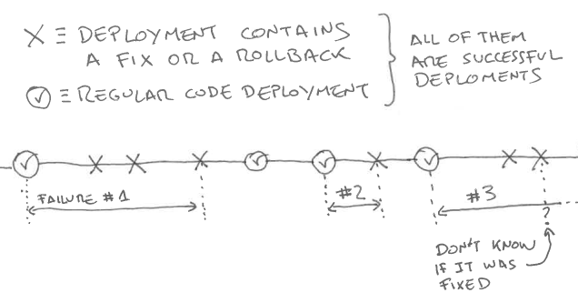

# @eamodeorubio <!-- .element: style="color: yellow;text-transform: none" -->

# Agile anyone??

### Agile is about <em>inspect</em> and <em>adapt</em>,
### about <em>continuous improvement</em>

### Inspect and adapt is done mostly through <em>retros</em>

### Retro gone bad

* Either venting/ranting or celebrating
* No focus on what went wrong and what went well
* No clear <em>actionable</em> outcomes
* No review of last actions results

### <em>Continuous improvement</em>

* Find problems
* Make hypothesis about problem root cause
* Figure out ways to address root cause `->` actions
* Did the last actions worked?
* Rinse and repeat!

### But, how do you know that the team has problems?

### Maybe gut feeling?
#### That may work sometimes

### Did the situation got better or worse after implementing the actions from the retro?

### Gut feeling again?
#### Everybody could have a different one

### I just prefer data!
#### (Disclaimer: <em>interpret</em> data, don't follow it blindly)

# ⏱️You should <em>measure</em> your <em style="color:yellow">CD</em>🔬

### Not in JIRA

* JIRA tickets are mostly updated manually!
* A lot of effort and discipline
* Easy to cheat

## ~Money~Code Talks!

### Use metrics

* Objective
* Easy to understand
* Depend as less as possible on manual steps/labeling
* Hard to cheat
* Measure <em>code</em> delivery `->` The <em style="color:yellow">CD</em> pipeline!

### Deployment frequency
#### Team <em>throughput</em>

* How many code changes does a <em>team</em> deliver by unit of time?
  * Team is the unit of organization and not individual engineers
  * Code change `->` Successful <em>production</em> deployment
* The higher the better

### Why increase deployment frequency?

* Probably code changes are smaller `->` Flow
* Less risk in a change
* Easier to debug a potential problem
* Cheaper to change plans `->` less work to throw away
* More predictable delivery

### Code delivery time (CDT)
#### Is the team fast?

* Time from <em>local code commit</em> to successful deployment on <em>production</em>
  * Code is the outcome of our work
  * Includes any review ceremony, build and testing, manual approvals, etc.
  * Code could be also a config change following modern DevOps practices
* The lower the better

### Why decrease code delivery time?

* The lower the <em>faster</em> we put changes into production!
* Better and faster automation
* Less waiting/iddle time
* Faster reaction time
* A sign of a healthy code base

### Change Failure Ratio (CFR)
#### Quality!

* How likely is a deployment to introduce a failure?
* The lower the better

### Mean time to restore (MTTR)
#### Are we fast fixing problems?

* Time from defect/incident detected to fix/resolution
* The lower the cheaper a problem is (less risky)!
* We can be more aggressive with shorter MTTR
* Caution: actual cost/risk depends on severity and impact of each problem

## Once you have data we can start talking seriously

## We decreased code delivery time by 20% but the change failure ratio increased by 50%!
#### Are we cutting corners in quality?

## Our deployment frequency decreased and then change failure ratio increased
#### Big changes leading to integration problems?

## Our metrics are highly <em>variable</em>!!
#### Tech debt we need to clean up?

## Wait...
#### Tech debt relates to metrics with high variance?

## Tech debt `->` lottery

* The `rabbit hole` effect
* Tech debt makes hard to predict if changes are needed
  * A healthy part of the system? `->` Won the lottery!
  * An unhealty part of the system? `->` Lost the lottery!

## Advise

* Aim first for <em>consistency</em> (low variability)
* Then achieve a trend of <em>continous improvement</em> for the metrics
* A bad number is ok if we are getting better and better
* A good number is bad is we are getting worse and worse

## How to measure?

### Not using webhooks

* Mostly at most once semantics `->` losing data points
* Not all systems have webhooks

### Cron jobs!

* Idempotent
* Safe restart
* Pull data and store events
* Tune batch size and frequency

### Grafana!

### Gathering deployment info

* Deployment pipeline/script exposes:
  * Deployment date
  * Whether it was successful
  * The changeset deployed (commit SHAs and repos)

### Deployment frequency

* Maintain a log of successful deployments
* Count successful deployments in a time window
* `Deployment frequency = #deployments / time window length`

### Code delivery time (CDT)

* `CDT = Deployment time - Oldest commit author date`
* Use commit *author* date, rebase/squash does not change it
* Expand merge commits (PRs or other branches)

### Measuring CFR and MTTR is harder
#### Involves counting <em class="bad">problems</em>

### What is a problem?

* A bug/defect
* System not available (not fulfilling SLOs)

### How to measure incidents

* Easy!
* Alerting platform (pagers)
  * Start time
  * Resolution time
  * Severity

### How to measure defects

* Hard!
* When did a bug was introduced?
* When was fixed?
* Requires a lot of discipline from humans

### Heuristic for counting defects

* Count fixes and rollbacks
* Not *followed* by another fix or rollback
* Whenever possible, count customer reported issues labeled as bugs

### Heuristic for defect duration
#### Basic approach

* We assume that the problem was:
  * Introduced in the last deployement that was not a fix/rollback
  * Fixed in the last fix/rollback not followed by another one

### Heuristic for defect duration
#### Sophisticated approach

* Trace customer issues:
  * Customer reported issue and resolution dates labeled as bugs
  * Commit labeled with customer issue
* For rollbacks we could know which changeset are we rolling back

### Measuring quality

* `CFR = (#incidents + #defects) / #deployments`
* `MTTR = sum(incidents duration, defects duration) / (#incidents + #defects)`

## Time for questions?